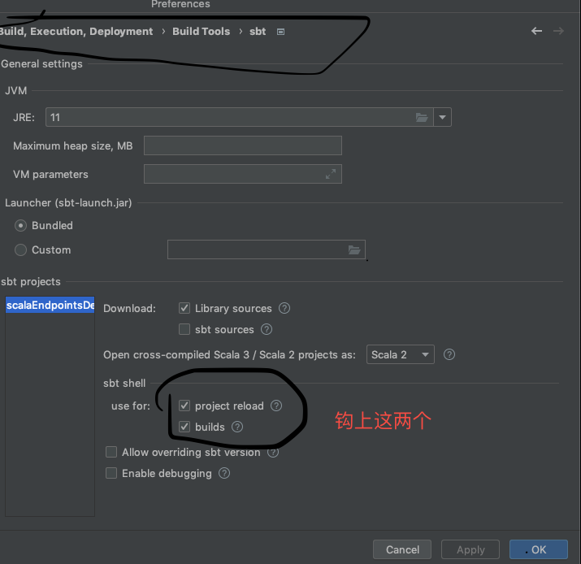
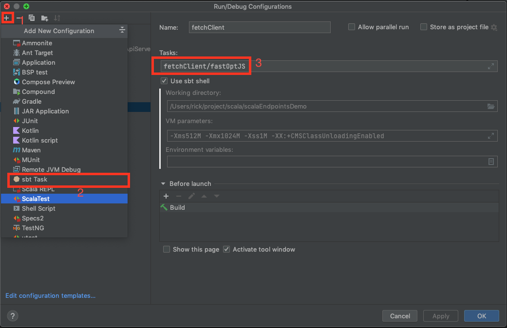

###玩具项目，请不要在生产上用这些代码

demo一下用scala做一个项目

用intellij安装scala插件

用intellij导入项目，安装scala插件

按照下面的图片配置好ide

点Edit Configurations按照图片的步骤添加编译客户端的sbt task，选中对应的sbt task点击run先编译好客户端

然后点进去akkaHttpServer/src/main/scala/endpoints4s/akkahttp/server/MyApiServer
点object MyApiServer 左边的三角形跑服务器

打开 http://127.0.0.1/fetchClient.html